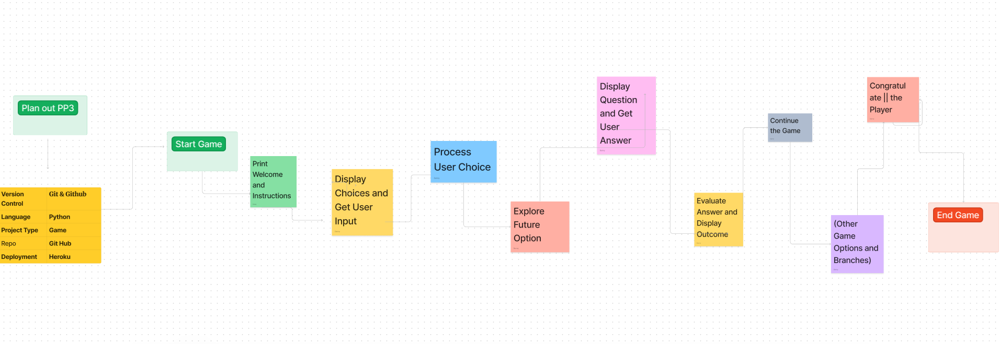

# Time Travel on the Python Commmad Line 


## Time Travel Adventure Game Overview

Welcome to the "Time Travel Adventure Game," an exciting text-based adventure that takes you on a journey through time and challenges your wits. In this game, you'll find yourself inside a mysterious time machine, facing a series of questions and riddles. Your mission is to answer them correctly and navigate through time portals to escape the time warp.

## Key Features

### 1. Time Travel Theme

- Immerse yourself in a time travel-themed adventure, where you encounter time portals leading to different eras and destinations.
- Explore a variety of time periods and unlock thrilling adventures in each.

### 2. Interactive Storytelling

- Engage in an interactive storyline that unfolds with each question you answer.
- Your choices determine the outcome of your adventure, adding an element of decision-making and suspense to the game.

### 3. Challenging Questions and Riddles

- Test your knowledge and critical thinking with a series of intriguing questions and riddles.
- Each question has multiple-choice answers, and you must select the correct one to progress.

### 4. Escape the Loop

- Your ultimate goal is to escape the time loop. To achieve this, you must successfully answer all questions and overcome the challenges posed by the time portals.
- Wrong answers may lead to starting over, so choose wisely!

### 5. Player Interaction

- Enter your name and age to personalize your gaming experience.
- Make choices during the game that affect the direction of your adventure.

### 6. Exciting Adventure Routes

- Explore various adventure routes associated with each question.
- These routes include futuristic cities, hidden treasures, ancient artifacts, and hidden gardens.

### 7. Game Progress Tracking

- Keep track of your progress as you answer questions correctly or face challenges.
- The game's logic ensures you only escape the loop once you've conquered all the obstacles.

### 8. Replayability

- With multiple questions and adventure routes, the game offers high replayability. Try different routes and challenge yourself to answer all questions correctly.

### 9. Enjoyable and Educational

- Have fun while expanding your knowledge and problem-solving skills.
- The game combines entertainment with a mental challenge, making it suitable for players of all ages.

### 10. Author Interaction

- If you have questions or need assistance, the game's author is available for support and feedback.

The "Time Travel Adventure Game" offers a captivating blend of time travel, puzzles, and decision-making, providing an enjoyable and immersive gaming experience. Embark on this adventure, answer the questions, and see if you can escape the time loop. Good luck, time traveler!

**Join Us:**

Ready to embark on an exciting journey through time? Join the Time Travel on the Python Commmad Line community and become a part of our time-traveling adventure!

How to Get Involved
Contribute to the Codebase: If you're passionate about game development, Python programming, or have creative ideas to enhance the gameplay, consider contributing to our open-source project on GitHub. Your contributions are highly valued!

Fork the repository: Time-Travel-on-the-Python-Commmad-Line
Make your improvements and enhancements.
Submit a pull request to share your changes with the community.
Report Bugs and Issues: Encountered a bug or have a suggestion for improvement? Let us know by opening an issue on GitHub. Your feedback helps us make the game better!

Open a New Issue
Spread the Word: Share the Time-Travel-on-the-Python-Commmad-Line with your friends, family, and fellow gamers! Help us grow our community and bring more adventurers into the time-traveling fold.

Tweet about the game: Time Travel on the Python Commmad Line
### Flowchart



# Time Travel on the Python Commmad Line

## Description


## Usage

Explain how to run and play the game.


## Apps Used

| App           | Description                |
| ------------- | -------------------------- |
| Git           | Version control system     |
| GitHub        | Code hosting platform      |
| CodeAnywhere  | Online code editor         |
| Heroku        | Deployment platform        |


## Getting Started


### Testing Carried Out 


### Test Results 


### Technologies Used


### Key Features


### Development Process


## Deployment

### Version Control
The site was created using Codeanywhere code editor and pushed to github to the remote repository ‘Time-Travel-on-the-Python-Commmad-Line’.

The following git commands were used throughout development to push code to the remote repo:

```git add <file>``` - This command was used to add the file(s) to the staging area before they are committed.

```git commit -m “commit message”``` - This command was used to commit changes to the local repository queue ready for the final step.

```git push``` - This command was used to push all committed code to the remote repository on github.
### Deployment to 

### Clone the Repository 


## Future Development


## Acknowledgments

Special thanks to:

- [Geek for Geeks](https://www.geeksforgeeks.org/) for the `pyfiglet` module.
- [Jamie O'Neill](https://www.linkedin.com/in/jamie2023/) (Code Institute cohort lead) for guidance and support throughout the project.


## Bugs


## Contact

Daniel Hughes, Mullingar Co Westmeath, Ireland.

Phone : +353 852570069

Email : danijhughes@gmail.com

Git Hub : danij1990

Linkedin: <https://www.linkedin.com/in/daniel-hughes-36a948258/>

Facebook: <https://www.facebook.com/danny.hughes.96558>