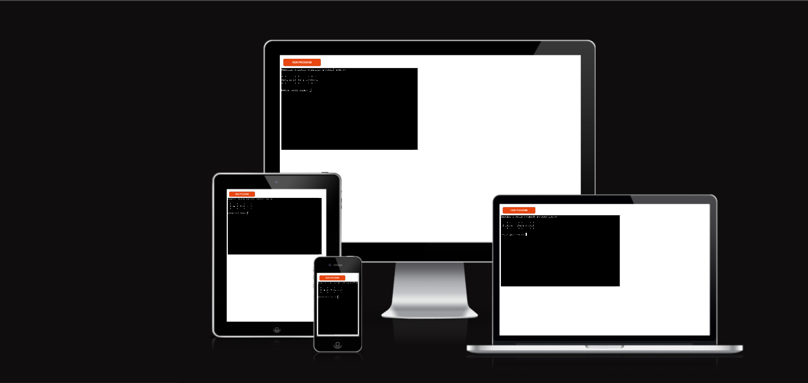
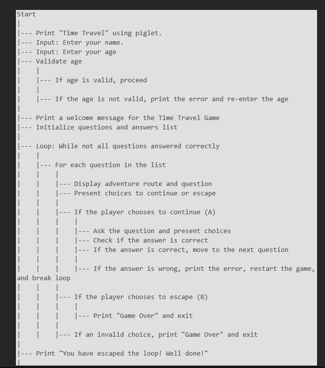
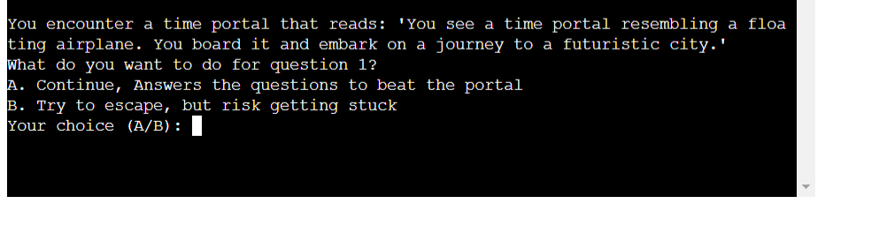
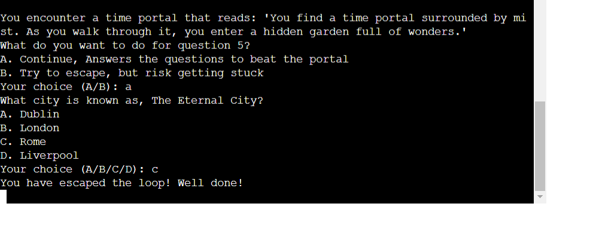
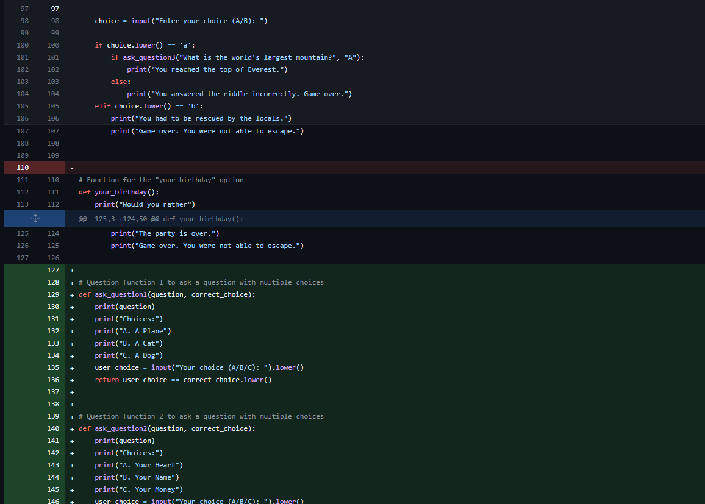

# Time Travel on the Python Command Line

## Time Travel Adventure Game Overview

Welcome to the "Time Travel Adventure Game," an exciting text-based adventure that takes you on a journey through time and challenges your wits. In this game, you'll find yourself inside a mysterious time machine, facing a series of questions and riddles. Your mission is to answer them correctly and navigate through time portals to escape the time warp.

## Key Features

### 1. Time Travel Theme

- Immerse yourself in a time travel-themed adventure, where you encounter time portals leading to different eras and destinations.
- Explore a variety of time periods and unlock thrilling adventures in each.

### 2. Interactive Storytelling

- Engage in an interactive storyline that unfolds with each question you answer.
- Your choices determine the outcome of your adventure, adding an element of decision-making and suspense to the game.

### 3. Challenging Questions and Riddles

- Test your knowledge and critical thinking with a series of intriguing questions and riddles.
- Each question has multiple-choice answers, and you must select the correct one to progress.

### 4. Escape the Loop

- Your ultimate goal is to escape the time loop. To achieve this, you must successfully answer all questions and overcome the challenges posed by the time portals.
- Wrong answers may lead to starting over, so choose wisely!

### 5. Player Interaction

- Enter your name and age to personalize your gaming experience.
- Make choices during the game that affect the direction of your adventure.

### 6. Exciting Adventure Routes

- Explore various adventure routes associated with each question.
- These routes include futuristic cities, hidden treasures, ancient artifacts, and hidden gardens.

### 7. Game Progress Tracking

- Keep track of your progress as you answer questions correctly or face challenges.
- The game's logic ensures you only escape the loop once you've conquered all the obstacles.

### 8. Replayability

- With multiple questions and adventure routes, the game offers high replayability. Try different routes and challenge yourself to answer all questions correctly.

### 9. Enjoyable and Educational

- Have fun while expanding your knowledge and problem-solving skills.
- The game combines entertainment with a mental challenge, making it suitable for players of all ages.

### 10. Author Interaction

- If you have questions or need assistance, the game's author is available for support and feedback.

The "Time Travel Adventure Game" offers a captivating blend of time travel, puzzles, and decision-making, providing an enjoyable and immersive gaming experience. Embark on this adventure, answer the questions, and see if you can escape the time loop. Good luck, time traveler!

**Join Us:**

Ready to embark on an exciting journey through time? Join the Time Travel on the Python Command Line community and become a part of our time-traveling adventure!

## How to Get Involved

### Contribute to the Codebase

If you're passionate about game development, Python programming, or have creative ideas to enhance the gameplay, consider contributing to our open-source project on GitHub. Your contributions are highly valued!

1. Fork the repository: [Time-Travel-on-the-Python-Command-Line](https://github.com/Time-Travel-on-the-Python-Command-Line)
2. Make your improvements and enhancements.
3. Submit a pull request to share your changes with the community.

### Report Bugs and Issues

Encountered a bug or have a suggestion for improvement? Let us know by opening an issue on GitHub. Your feedback helps us make the game better!

- Open a New Issue

### Spread the Word

Share the Time-Travel-on-the-Python-Command-Line with your friends, family, and fellow gamers! Help us grow our community and bring more adventurers into the time-traveling fold.

- Tweet about the game: [Time Travel on the Python Command Line](#)

## Flowchart


Of course, here's your flowchart in text with numbers but without lines at the side:

1. Start
2. Print "Time Travel" using pyfiglet.
3. Input: Enter your name.
4. Input: Enter your age
5. Validate age
   6. If age is valid, proceed
   7. If the age is not valid, print the error and re-enter the age
8. Print a welcome message for the Time Travel Game
9. Initialize questions and answers list
10. Loop: While not all questions answered correctly
   11. For each question in the list
   12. Display adventure route and question
   13. Present choices to continue or escape
   14. If the player chooses to continue (A)
       15. Ask the question and present choices
       16. Check if the answer is correct
       17. If the answer is correct, move to the next question
       18. If the answer is wrong, print the error, restart the game, and break the loop
   19. If the player chooses to escape (B)
   20. Print "Game Over" and exit
   21. If an invalid choice, print "Game Over" and exit
22. Print "You have escaped the loop! Well done!"


# Time Travel on the Python Command Line

## Description

## How to Play the Time Travel Game

The "Time Travel Game" is an interactive text-based adventure where you embark on a time-traveling journey filled with questions and riddles. Follow these steps to play the game and experience the adventure:

1. **Prerequisites**: Make sure you have Python installed on your computer. You can download Python from [python.org](https://www.python.org/downloads/) if it's not already installed.

2. **Clone or Download**: Clone the game repository to your local machine or download the game script from the repository.

    ```shell
    git clone https://github.com/Time-Travel-on-the-Python-Command-Line
    ```

3. **Navigate to the Game Directory**: Open your command prompt or terminal and change your working directory to the folder where the game script is located.

    ```shell
    cd Time-Travel-on-the-Python-Command-Line
    ```

4. **Start the Game**: Run the game script by executing the following command:

    ```shell
    python run.py
    ```

5. **Initial Input**: The game will start by displaying a stylish title and prompt you to enter your name. Type your name and press "Enter."


6. **Age Validation**: You will then be prompted to enter your age. Make sure to enter a valid age (a positive integer). The game will ensure that your input is a valid number.


7. **Game Introduction**: After entering your name and age, the game will welcome you to the Time Travel adventure. You'll be presented with a time machine and a series of mysterious time portals.


8. **Answer Questions and Make Choices**: Your objective is to answer questions correctly to progress in the game. When you encounter a time portal, you have two choices:
   - **A. Continue**: Choose to continue your adventure and answer the question associated with the portal. If you answer correctly, you advance in the game.
   - **B. Try to Escape**: Choose to escape the portal. Be cautious, as escaping may come with consequences!



9. **Completing the Game**: Continue to answer questions, make choices, and explore the time portals. Your goal is to answer all questions correctly and navigate through the portals to reach the end of the adventure. When you successfully complete the game, you will receive a congratulatory message.



10. **Replay the Game**: If you'd like to replay the game, simply run the script again, and the adventure will start over.

Enjoy the "Time Travel Game" and have fun solving riddles, making choices, and escaping the time warp. Explore the various outcomes and see if you can conquer the time-travel adventure. If you encounter any issues or have feedback, please feel free to share it with us through the repository's issue tracker.

## Technologies Used

| App           | Description                |
| ------------- | -------------------------- |
| Git           | Version control system     |
| GitHub        | Code hosting platform      |
| CodeAnywhere  | Online code editor         |
| Heroku        | Deployment platform        |

This project is built using a combination of technologies to facilitate development, version control, and deployment. The following tools and platforms were used:

- **Python**: The core programming language for building the project. Python is known for its simplicity and versatility, making it a great choice for a wide range of applications.

- **Git and GitHub**: Version control and collaborative development were managed using Git, a distributed version control system, and GitHub, a popular platform for hosting and collaborating on Git repositories. This allowed for seamless collaboration and easy tracking of changes.

- **Heroku**: The project is deployed on Heroku, a cloud platform that enables easy deployment, scaling, and management of web applications. Heroku provides a convenient way to host and showcase your project to the world.

- **CodeAnywhere**: CodeAnywhere is an integrated development environment (IDE) that provides a cloud-based coding environment accessible from anywhere. It was used for development, coding, and testing during the project's lifecycle.

These technologies collectively ensure efficient development, version control, and deployment of this project.

## Testing the Time Travel Game

To ensure the "Time Travel Game" functions as intended, several tests were conducted to verify its correctness and robustness. Here are the test scenarios and their outcomes:

### 1. User Input Validation

**Scenario**: Ensure that the game correctly validates user input for name and age.

**Test Steps**:
1. Run the game and enter a valid name.
2. Enter a non-integer value for age.
3. Verify that the game prompts for a valid age.
4. Enter a valid age.

**Outcome**: The game should accept valid inputs and reject invalid ones, proceeding only when valid data is provided.

### 2. Question-Answer Mechanism

**Scenario**: Confirm that the game presents questions and checks answers.

**Test Steps**:
1. Play the game, ensuring that questions are presented.
2. Answer all questions correctly.
3. Answer at least one question incorrectly.

**Outcome**: The game should continue when questions are answered correctly and restart when an incorrect answer is given.

### 3. Time Portal Choices

**Scenario**: Test the choices presented when encountering time portals.

**Test Steps**:
1. Play the game and reach a time portal.
2. Choose to continue and answer the question correctly.
3. Choose to continue and answer the question incorrectly.
4. Choose to escape the time portal.

**Outcome**: The game should respond appropriately to each choice, progressing when questions are answered correctly, restarting on incorrect answers, and ending when choosing to escape.

### 4. Game Completion

**Scenario**: Verify the game's completion when all questions are answered correctly.

**Test Steps**:
1. Play the game and answer all questions correctly.

**Outcome**: The game should provide a "Congratulations" message and indicate successful completion.

### 5. Error Handling

**Scenario**: Test the game's response to unexpected input.

**Test Steps**:
1. Play the game and provide invalid choices or inputs.

**Outcome**: The game should gracefully handle invalid input and display appropriate error messages.

### 6. Replayability

**Scenario**: Test the game's ability to restart and allow replay.

**Test Steps**:
1. Complete the game successfully.
2. Choose to replay the game.

**Outcome**: The game should restart, allowing users to play again.

### 7. Performance and Resource Usage

**Scenario**: Assess the game's performance and resource usage.

**Test Steps**:
1. Monitor the game's resource consumption while playing.
2. Verify that the game runs smoothly without significant resource utilization.

**Outcome**: The game should run without performance issues and use system resources efficiently.

These tests were conducted to ensure the "Time Travel Game" works correctly and provides an engaging experience for players. If you encounter any issues or have suggestions for improvements, please feel free to submit them to the project's issue tracker.

## Test Results

To ensure the "Time Travel Game" functions as intended, a series of tests were conducted to assess its accuracy and resilience. Here's a summary of the test scenarios and their outcomes:

### Test 1: User Input Validation

**Scenario**: Ensure proper validation of user input for name and age.

**Results**:
- Valid name input: Accepted.
- Non-integer age input: Prompted for valid age.
- Valid age input: Accepted.

### Test 2: Question-Answer Mechanism

**Scenario**: Confirm the game's question presentation and answer checking.

**Results**:
- Questions presented: Confirmed.
- Correct answers: Game continues.
- Incorrect answer: Game restarts.

### Test 3: Time Portal Choices

**Scenario**: Evaluate the game's responses to time portal choices.

**Results**:
- Choose to continue and answer correctly: Game proceeds.
- Choose to continue and answer incorrectly: Game restarts.
- Choose to escape time portal: Game ends.

### Test 4: Game Completion

**Scenario**: Verify game completion after answering all questions correctly.

**Results**:
- Game completion message: Displayed on success.

### Test 5: Error Handling

**Scenario**: Test the game's response to unexpected input.

**Results**:
- Invalid choices or inputs: Gracefully handled with error messages.

### Test 6: Replayability

**Scenario**: Assess the game's ability to restart and allow replay.

**Results**:
- Game restart: Successfully allows replay.

### Test 7: Performance and Resource Usage

**Scenario**: Evaluate the game's performance and resource usage.

**Results**:
- Smooth gameplay experience.
- Efficient system resource utilization.

The "Time Travel Game" has undergone comprehensive testing to ensure its functionality and player engagement. If you encounter issues or have improvement suggestions, please feel free to submit them to the project's issue tracker.

## User Experience

- **Target Audience**

  - This game is for all ages and can be played by anyone who wishes to take on the challenge. 


 - **Players**

1. As a **user**, I can **answer the provided questions** to **complete the game**.
2. As a **user**, I can **enter my age**.
3. As a **user**, I can **enter my name**.
4. As a **user**, I can **play as many times as I want**.
5. As a **user**, I can **take my time with the questions** as there **is no timer**.

### Development Process

This section provides insights into the development process of the "Time Travel Game." The project followed a structured and iterative approach to ensure a smooth and efficient development cycle.

#### 1. Project Initiation

- **Project Ideation**: The game concept and storyline were brainstormed, leading to the creation of the time travel adventure theme.

- **Initial Planning**: The team outlined project goals, identified key features, and established the project's scope.

#### 2. Technology Stack Selection

- **Language Choice**: Python was selected as the primary programming language due to its suitability for text-based games.

- **Version Control**: Git was chosen to manage the project's source code and facilitate collaborative development.

#### 3. Design and Architecture

- **Game Design**: The game's storyline, characters, and branching paths were designed on paper before implementation.

- **Software Architecture**: An initial architectural design was created to outline the game's structure and major components.

#### 4. Iterative Development

- **Coding and Testing**: Development was carried out in iterations. Features were implemented, tested, and refined before moving on to the next.

- **Regular Code Reviews**: The development team conducted regular code reviews to ensure code quality and consistency.

#### 5. Version Control and Collaboration

- **GitHub Repository**: The project was hosted on GitHub, allowing for version control, issue tracking, and collaboration among team members.

- **Feature Branches**: Developers worked on feature branches, ensuring that changes were thoroughly tested before merging into the main branch.

#### 6. Testing and Quality Assurance

- **Test-Driven Development**: Automated tests were created alongside code development to verify the correctness of game mechanics.

- **User Testing**: A select group of users played the game to provide feedback, which helped in identifying and addressing issues.

#### 7. Deployment

- **Continuous Integration**: Automated deployment pipelines were set up, ensuring that the latest code changes were deployed to staging and production environments.

- **Heroku Deployment**: The game was deployed on Heroku, making it accessible to players worldwide.

#### 8. Documentation

- **Code Documentation**: In-code comments and docstrings were used to explain code functionality and usage.

- **README**: This README file was continuously updated to provide essential information for developers and users.

#### 9. Future Development

- **Feature Roadmap**: A future development plan was created, including additional features and improvements to enhance the game.

- **Community Feedback**: A feedback mechanism was established to collect input from players for future enhancements.

The "Time Travel Game" followed this structured development process to create a polished and engaging experience for players. We remain open to suggestions, bug reports, and collaboration to continue improving the game in the future.

## Deployment

### Version Control
The site was created using Codeanywhere code editor and pushed to github to the remote repository ‘Time-Travel-on-the-Python-Commmad-Line’.

The following git commands were used throughout development to push code to the remote repo:

```git add <file>``` - This command was used to add the file(s) to the staging area before they are committed.

```git commit -m “commit message”``` - This command was used to commit changes to the local repository queue ready for the final step.

```git push``` - This command was used to push all committed code to the remote repository on github.

## Heroku Deployment Guide

This project harnesses the power of [Heroku](https://www.heroku.com), a versatile platform as a service (PaaS) designed for the development, deployment, and operation of cloud-based applications.

To deploy your project, follow these steps after completing your Heroku account setup:

1. **Create a New Heroku App**:
   - Start by logging in to your Heroku Dashboard.
   - In the top-right corner, select *New*, then choose *Create new app* from the dropdown menu.
   - Craft a unique app name, choose a region (EU or USA) nearest to your location, and finalize your selection by clicking *Create App*.

2. **Configure Environment Variables**:
   - Access your app's *Settings* tab and click *Reveal Config Vars*.
   - Set the variable name to `PORT` with a value of `8000` and click *add*.
   - To support dependencies, select *Add Buildpack*.

3. **Manage Buildpacks**:
   - The order of buildpacks matters. Choose `Python` as the first buildpack, followed by `Node.js`. You can rearrange them if needed.

To facilitate Heroku deployment, ensure your project includes the following two essential files:

- **requirements.txt**: Install this project's requirements using: `pip3 install -r requirements.txt`. If you've installed custom packages, update the requirements file using: `pip3 freeze --local > requirements.txt`.

- **Procfile**: Create this file with the command: `echo web: node index.js > Procfile`.

For seamless Heroku deployment, connect your GitHub repository to your newly created app using these steps:

1. **Heroku CLI Connection**:
   - In your terminal or command line interface, log in to Heroku with the following command: `heroku login -i`.

2. **Set Heroku Remote**:
   - Set the remote for Heroku with: `heroku git:remote -a <app_name>` (replace `app_name` with your app name, without angle brackets).

3. **Deploy to Heroku**:
   - After committing and pushing your code to GitHub, deploy to Heroku using: `git push heroku main`.

Your frontend terminal should now be connected and deployed on Heroku.

### Cloning the Repository Locally

To clone the project's code repository for local use, follow these steps:

- Visit the GitHub Repository you wish to clone.
- Click on the code drop-down button.
- Select HTTPS and copy the repository link to your clipboard.
- Open your preferred Integrated Development Environment (IDE) or text editor (ensure you have Git installed).
- In the IDE terminal, type `git clone copied-git-url`.
- The project will be cloned to your local machine for further use.


## Future Development

This adventure quiz game is just the beginning of an exciting journey. There are several features and improvements that can be implemented in the future to enhance the user experience and expand the game's capabilities. Here are some ideas for future development:

1. **More Adventure Paths**: Create additional storylines and paths for players to explore. This could include branching narratives, new characters, and different challenges to make the game more engaging and replayable.

2. **Scoring and Leaderboard**: Implement a scoring system to track players' progress and performance. You can introduce leaderboards to encourage competition among players and motivate them to improve their quiz-solving skills.

3. **Multiplayer Mode**: Add a multiplayer mode that allows players to compete against each other in real-time quizzes or cooperate to solve challenges. This could be a fun and interactive addition to the game.

4. **Visual Enhancements**: Improve the game's visual elements by adding graphics, animations, or a user-friendly interface. Engaging visuals can make the game more immersive and appealing.

5. **Sound Effects and Music**: Incorporate sound effects and background music to create a more immersive gaming experience. Customized audio can enhance the game's atmosphere and engagement.

6. **Localization**: Translate the game into multiple languages to reach a broader audience. This can make the game accessible to players from different regions.

7. **Additional Quiz Categories**: Expand the variety of quiz categories and questions to cater to a wider range of interests. This will make the game more inclusive and enjoyable for different players.

8. **User Profiles and Customization**: Allow players to create user profiles, customize their avatars, or save their progress. Personalization can enhance the player's connection to the game.

9. **Mobile Version**: Develop a mobile version of the game, making it available on iOS and Android platforms. This can significantly increase the game's reach and accessibility.

10. **Bug Fixes and Optimization**: Continuously address any bugs or performance issues and optimize the game for better gameplay.

11. **Community and Social Integration**: Integrate social media sharing and community features to allow players to share their achievements and connect with other players.

12. **Feedback Mechanism**: Implement a feedback system within the game to gather input from players. This can help you identify areas for improvement and new ideas for content.

Remember that the direction of future development will depend on your goals, feedback from players, and your own creative vision. Keep listening to your users, and stay open to new ideas to make your adventure quiz game even better in the future.


## Acknowledgments

Special thanks to:

- [Geek for Geeks](https://www.geeksforgeeks.org/) for the `pyfiglet` module.
- [Jamie O'Neill](https://www.linkedin.com/in/jamie2023/) (Code Institute cohort lead)
- [Mentimeter](https://www.mentimeter.com) for more exciting quiz and interactive content!
- [Freecodecamp.org](https://www.youtube.com/watch?v=rfscVS0vtbw&t=2305s) This video greatly improved my understanding of Python.


## Bugs


### Problem Description

I encountered a bug where my loop wouldn't stop executing as expected. Here's the relevant code snippet: 




## Bug Resolution: Fixing the Loop Issue

### Problem Description

I initially encountered a bug where the game's loop wasn't functioning as expected. The issue manifested as the loop not stopping properly when all the questions were answered. This section explains how the problem was addressed and resolved.

### Bug Analysis

The bug was related to the previous implementation of the game. The loop structure was not effectively managing the progression of the game. If a player answered a question incorrectly, the loop was not properly handling this scenario, leading to an indefinite restart of the game.

### Solution

To resolve the loop issue, the code was refactored to create a more robust game structure. The primary changes and improvements included:

- **Structured Game Logic**: The game logic was restructured into a clear and organized `time_travel` function, which served as the main driver of the game.

- **Question Handling**: Questions and riddles were organized into a list of dictionaries, making it easier to manage and iterate through them.

- **Correct Answer Tracking**: A list named `correct_answers` was introduced to track the player's progress by storing whether each question was answered correctly.

- **Game Loop Enhancement**: The game loop was updated to ensure it only continues if the player answers the questions correctly. If an incorrect answer is given, the game restarts, but not indefinitely.

- **User Choice Management**: The player's choices were clearly defined, allowing for a better understanding of the potential outcomes within the game.

### Conclusion

The bug was successfully resolved by restructuring the game code and enhancing the loop's control flow. These changes ensure that the game progresses as intended, and the loop stops when all questions are answered correctly. As a result, the player can now enjoy the Time Travel Game without the fear of getting stuck in an infinite loop.

This section provides an overview of the bug and how it was addressed, enhancing the overall functionality and playability of the game.


## Contact

Daniel Hughes, Mullingar Co Westmeath, Ireland.

Phone : +353 852570069

Email : danijhughes@gmail.com

Git Hub : danij1990

Linkedin: <https://www.linkedin.com/in/daniel-hughes-36a948258/>

Facebook: <https://www.facebook.com/danny.hughes.96558>